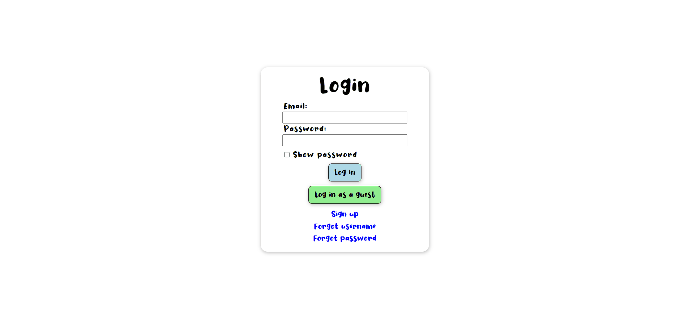

# Daily Happiness

Daily Happiness is a web application that allows users to store happy memories to be viewed later at random, whether it be immediately or months later.

View the hosted site here: [Daily Happiness](https://daily-happiness.netlify.app/)

## Usage

* Login/signup with your own account or login with a guest account
* Click the pencil icon to save some text with an optional photo
* Click the book icon to view memories you have saved
* If you have saved 2 or more memories, you will have to option to toggle through them randomly
* Use the sound icon to toggle the background music

## Testing
    npx cypress run

## Contributing

Pull requests are welcome. For major changes, please open an issue first
to discuss what you would like to change.

Please make sure to update tests as appropriate.

